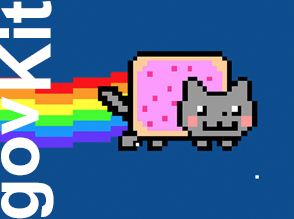

# govKit - a lightweight Drupal 7 theme base on the GOV.AU UI-Kit

<p align="center"></p>

* About the GOV.AU UI-Kit: https://github.com/govau/uikit
* About the Australian Government Deisgn System: https://designsystem.gov.au

## Table of contents

- [Quick start](#quick-start)
- [Source files](#source-files)
- [Commands](#commands)
- [License](#license)


## Quick start
1. Run `npm install`. This may take a while and if it stalls, delete the `node_modules` directory and start over
2. Copy `config-local-example.json` to `config-local.json` and change the browserSync proxy to your local development URL

## Source files

Default source file directories are under `src`. 

```text
govkit/
├── images/
├── css/
│   └── style.css
├── js/
│   └── script.js   
└── src/
    ├── images/
    ├── js/
    │   └── script.js  
    ├── scss/    
    │   ├── style.scss   
    │   ├── components/*.scss  
    │   ├── layouts/*.scss
    │   └── setup/*.scss
    └── uikit/
        ├── css/
        ├── js/
        ├── react/
        └── scss/
```

* SCSS source files `src/scss`
* JS source files `src/js`
* Image source files `src/images`
* The UI Kit source files are here `src/uikit`

Those can be changed to your liking by editing `config.json`. All source files with `.js` and `.scss` extensions under their respective directory will be compiled. This may not be desirable if you would like to control the order the SCSS files are included. Edit `config.json` accordingly if you would like to specify the include order of the source files.

## Commands

### Production deployment

From the theme directory, run `gulp`

**This does the following:**
* compile SCSS and JS source files
* optimise image source files
* compress CSS
* monify JS

You may choose to enable/disable image optimisation by editing `gulpfile.js`. If task `images` is enabled, the task may take a while to run, please be patient.

### Local development

From the theme directory, run `gulp dev`

**This does the following:**
* source mapping for both SCSS and JS
* watch for SCSS and JS source file changes
* compile SCSS into CSS nested style
* output un-minified JS
* launch browserSync 

### JS Linting

From the theme directory, run `gulp js-lint`

## License
Copyright &copy; Icon Agency Canberra. Licensed under ISC.